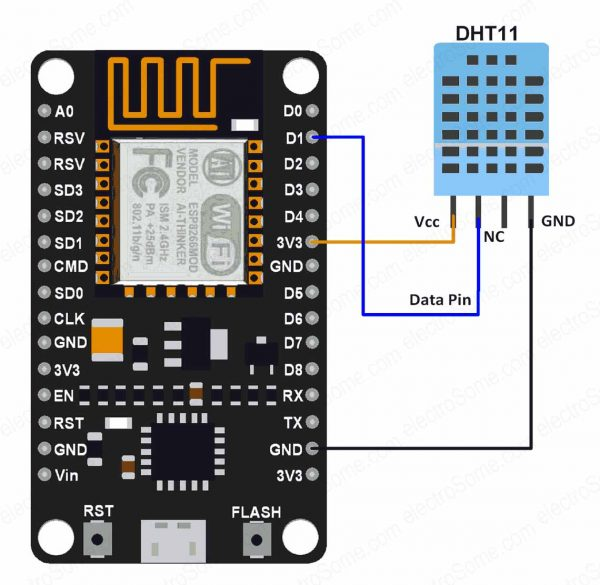
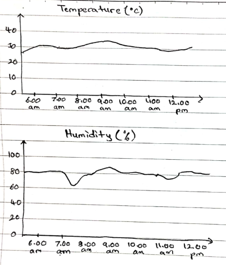

# IoT Weather Reporting System

Group: Graceful Griffin

Members:
- Muhammad Abdul Salam Bin Razak
- Muhammad Arif Iskandar Bin Abd Wahadi
- Muhammad Asy-Syakirin Bin Norhisham

 

## Table of Contents

 [STAGE 1: Foundations](#stage-1-foundations)

 [STAGE 2: Proposal](#stage-2-proposal)

+ [1.0 Problem Statement](#10-problem-statement)
+ [2.0 System Architecture](#20-system-architecture)
+ [3.0 Sensors](#30-sensors)
+ [4.0 Cloud Platform](#40-cloud-platform)
+ [5.0 Dashboard](#50-dashboard)

 [STAGE 3: Send Realtime Data to Server](#stage-3-send-realtime-data-to-server)

 [STAGE 4: Send Sensor Data to Database](#stage-4-send-sensor-data-to-database)

 [STAGE 5: Update Live Data in Grafana Dashboard](#stage-5-update-live-data-in-grafana-dashboard)

 [CONCLUSION](#conclusion)
 
 

## STAGE 1: Foundations

1.2 [Collaborating on Github Account](https://youtu.be/s4JhGpIjmW8)

1.3 [Local Python-based Web Server](https://youtu.be/-V4pbMBlVnU)

 

## STAGE 2: Proposal

## 1.0 Problem Statement

The current weather reporting systems are either limited in their coverage or provide delayed information, which makes it difficult for individuals to make informed decisions regarding outdoor activities, crop management, transportation, and emergency response. The system should be able to collect and analyze weather data from multiple sensors and sources, and present it in an easily understandable format. 

 

## 2.0 System Architecture

In order to overcome these issues, we develop a weather reporting system using IoT. This system use a sensor which is DHT11 sensor for temperature and humidity where it will send the data to the dashboard for the user to get the current reading.

Figure 2.1: System Architecture

 

## 3.0 Sensors

Sensors and devices used in this project:
- NodeMCU ESP8266
- DHT11 sensor

Proposed data transmission protocol: **HTTP**

Figure 3.1: Wiring connections

 

## 4.0 Cloud Platform

Link to How to deploy Django app to PythonAnywhere [here](https://youtu.be/yZY-izd_qI4).

 

## 5.0 Dashboard

Figure 5.1: Sketching of dashboard appearance

 

## STAGE 3: Send Realtime Data to Server

The ESP8266 device transmits temperature and humidity data from the DHT11 sensor to the Django web server using HTTP POST requests. The Django web application then updates the temperature and humidity readings dynamically, with a delay of approximately 5 seconds, without requiring the user to manually refresh the page. This ensures that the displayed status of temperature and humidity remains up-to-date without any user intervention.

To create visually appealing representations of weather data, it is necessary to develop HTML templates that effectively display temperature and humidity trends in a user-friendly manner. Django, a web framework, offers a robust templating engine that facilitates the creation of reusable HTML templates featuring dynamic content. These templates can incorporate Python code to generate weather data and pass it to the HTML for presentation. By leveraging Django's built-in support for forms and models, interactive dashboards and panels can be developed, enabling users to filter and manipulate the weather data as desired.

[Demo video for Stage 3](https://youtu.be/ZwxG8IxD1Hw)

 

## STAGE 4: Send Sensor Data to Database

The ESP8266 device utilizes HTTP POST requests to transmit temperature and humidity data from the DHT11 sensor to a Django web server. The Django server has a designated URL that accepts and parses these POST requests, subsequently storing the received data into a connected MySQL database.

The provided PHP code establishes a connection to a MySQL database using the mysqli_connect() function and stores the resulting connection object in the $conn variable. The code then verifies if the "temperature" and "humidity" variables are set in the $_POST superglobal array using the isset() function. If these variables are set, their values are retrieved and stored in the $t and $h variables respectively.

Next, the code constructs an SQL INSERT statement using the retrieved temperature and humidity values, and inserts them into the "dht11" table of the database using the mysqli_query() function. If the query is successful, the code outputs the message "New record created successfully". However, if an error occurs, it outputs an error message along with the SQL query and the error message returned by mysqli_error().

To utilize this PHP file for receiving data from an ESP8266 device via the HTTP protocol, the ESP8266 needs to send an HTTP POST request to the URL of this PHP file. The request should include the temperature and humidity values as key-value pairs within the request body. The ESP8266 can utilize the HTTPClient library to make the HTTP request and include the temperature and humidity values in the request body. Upon receiving the data, the PHP file inserts it into the MySQL database. Consequently, the Django web application dynamically updates the user interface by retrieving the necessary data from the database and processing it within the application to be presented in the server.

[Demo video for Stage 4](https://youtu.be/YAVZvHQAA3Q)

 

## STAGE 5: Update Live Data in Grafana Dashboard

Grafana is an exceptional data visualization tool known for its robust features and user-friendly interface. It empowers users to create visually captivating and informative dashboards and graphs effortlessly. By leveraging Grafana, the process of analyzing and monitoring data becomes simplified, as it offers a wide range of customizable and interactive visual representations. Whether you need to track temperature and humidity trends or any other metrics, Grafana provides a seamless experience for gaining valuable insights and making data-driven decisions.

One of the key advantages of Grafana is its flexibility and intuitiveness. It allows users to easily configure and customize visualizations to meet their specific requirements. With Grafana, you have the freedom to tailor the dashboards and graphs according to your unique needs and preferences. This flexibility makes it an invaluable tool for individuals and organizations alike, as it enables effective data analysis and presentation in a visually compelling and easily comprehensible manner.

In summary, Grafana stands out as a powerful and user-friendly data visualization tool that simplifies the process of analyzing and monitoring data. Its customizable and interactive nature empowers users to create visually captivating dashboards and graphs, facilitating valuable insights and informed decision-making. By utilizing Grafana, individuals and organizations can effectively analyze and present data in a visually appealing and easily understandable format, enhancing their overall data visualization capabilities.

[Demo video for Stage 5](https://youtu.be/BCQT7rBs-K0)

 

## CONCLUSION

The IoT Weather Reporting System is a comprehensive solution that combines the DHT11 sensor, ESP8266 microcontroller, Django, XAMPP and Grafana to monitor and analyze weather data. This integrated system enables real-time data collection, storage, visualization, and remote access. The DHT11 sensor plays a crucial role in accurately measuring temperature and humidity, providing up-to-date weather data for analysis and decision-making. When connected to the ESP8266 microcontroller, it becomes a reliable source of weather information. This system utilizes XAMPP, which includes Apache and MySQL, as a local server solution for efficient data storage and management. This ensures a smooth flow of data from the ESP8266 microcontroller to the Django server.

Grafana is utilized in this system to visualize and analyze weather data in a visually appealing and insightful manner. Through customizable dashboards and graphs, users can easily monitor and receive notifications about temperature and humidity trends. This feature is particularly useful in monitoring weather conditions. By integrating PyhtonAnywhere, it will enables cloud publishing, allowing weather data to be accessed from any device with an internet connection. Secure tunnels are created, granting remote access to the local XAMPP server and facilitating real-time monitoring of weather conditions.

This system is designed for scalability and flexibility. The ESP8266 microcontroller can accommodate additional sensors for measuring various weather parameters such as pressure, wind speed, or rainfall. This expandability seamlessly integrates the additional data into the existing system architecture, ensuring its storage in the XAMPP server and visualization through Grafana.

In summary, the IoT Weather Reporting System, with its combination of DHT11, ESP8266 microcontroller, Django, XAMPP and Grafana provides a comprehensive solution for monitoring and analyzing weather data. This system offers real-time data collection, storage, visualization, and remote accessibility. Additionally, it provides valuable insights into weather patterns for various applications.
